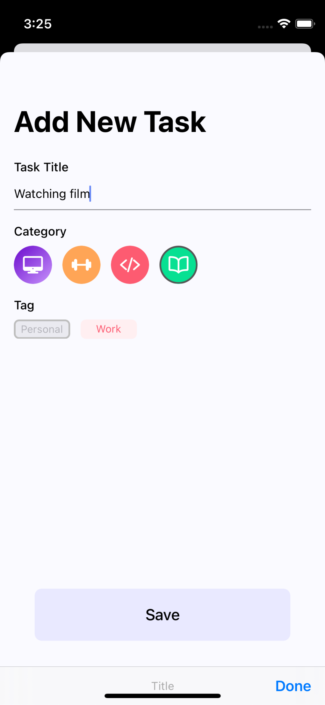
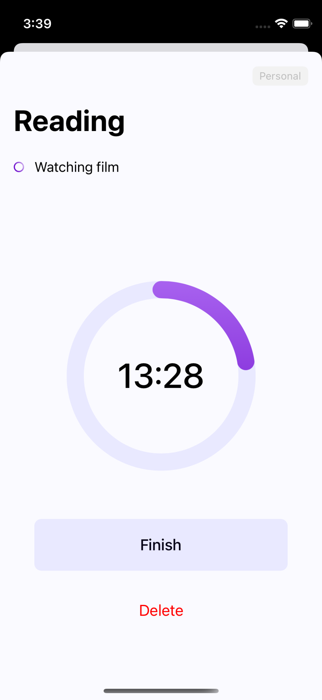
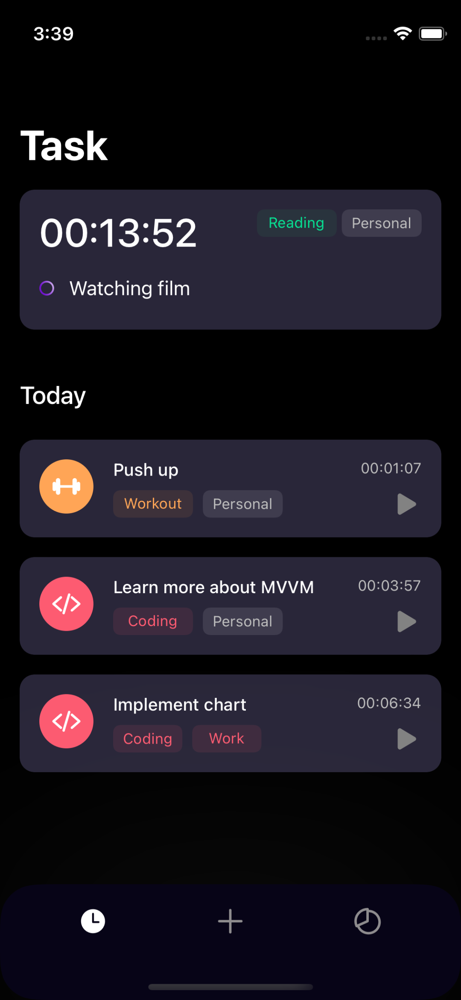
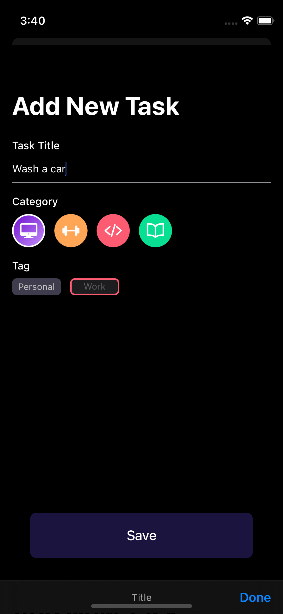
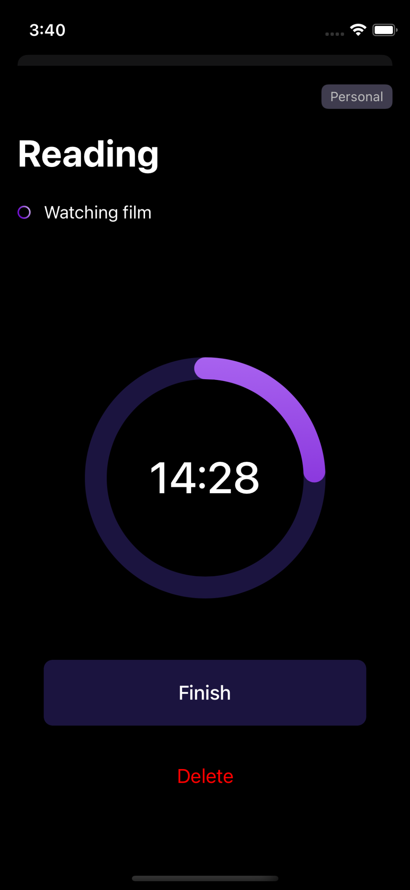

# TimePad iOS App #
TimePad is an app to organize tasks, so that we are more organized and structured in doing our daily work. Uses the timer feature to count how long we take on a task, this app uses RealmSwift as local storage.

### Screenshots ###
#### Light Mode ####
  

#### Dark Mode ####
  

### Tech & Dependenciesa ###
* [Swift](https://developer.apple.com/swift/)
* [UIKit](https://developer.apple.com/documentation/uikit)
* [Realm Swift](https://www.mongodb.com/docs/realm/sdk/swift/)
